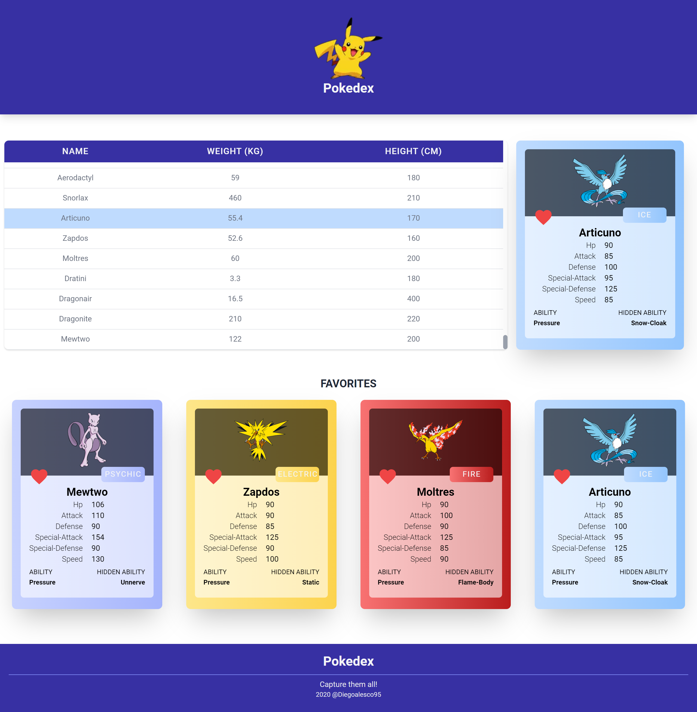

# POKEDEX

Building a pokedex as a practice exercise using NextJS 10 and Redux

## 🚀Getting Started

### ✔ Pre-requirements

- Node 12

### ✔ Installation

1. Clone this repository.
2. _`npm install`_ to install dependencies.
3. _`npm run dev`_ to run development environment.
4. _`npm run build`_ to export to production.
5. _`npm run start`_ to run production environment.

## 🚩 Technologies

- [React](https://reactjs.org/)
- [Next.JS](https://nextjs.org/docs/getting-started)
- [TailwindCSS](https://tailwindcss.com/docs/installation)
- [React Redux](https://react-redux.js.org/)

## 💻 Preview

